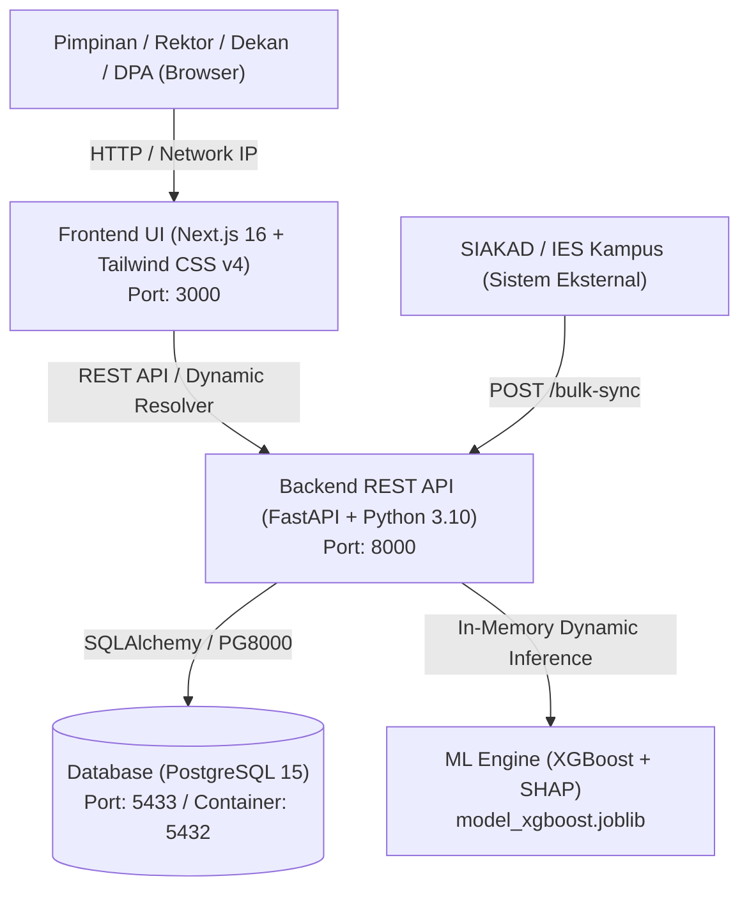
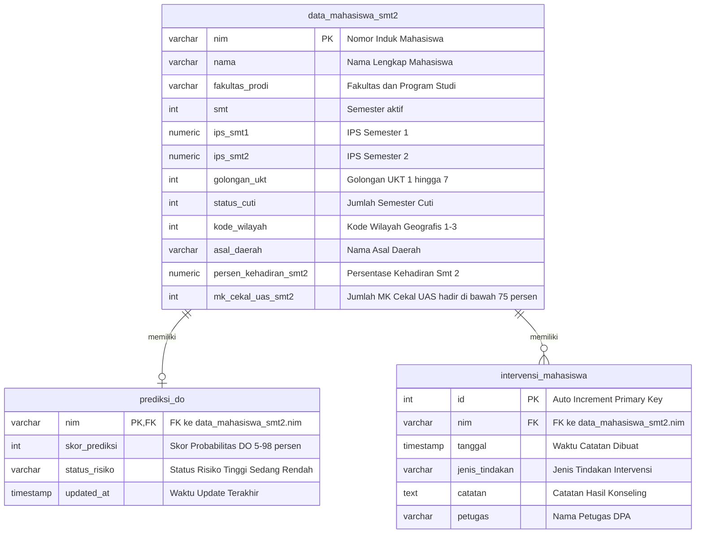
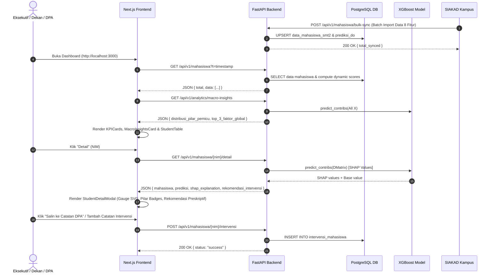

# Dokumentasi Komprehensif Sistem Siprido EIS
> **Siprido** — *Executive Information System (EIS) Prediksi Drop Out (DO) Mahasiswa*

Dokumen ini berisi panduan dan penjelasan teknis komprehensif mengenai arsitektur sistem, teknologi, skema database, model Machine Learning & SHAP, API endpoints, modul analitik makro, modul intervensi, serta alur kerja (*system workflow*) pada Siprido EIS.

---

## 1. Arsitektur & Teknologi (Tech Stack)

Siprido EIS dibangun menggunakan arsitektur modern terpisah (*decoupled frontend & backend*) berbasis kontainer Docker yang siap untuk integrasi skala universitas (SIAKAD/IES).



### Stack Teknologi Utamanya:

| Komponen | Teknologi | Deskripsi & Peran |
| :--- | :--- | :--- |
| **Frontend UI** | Next.js 16 (App Router), React 19, TypeScript | Dashboard interaktif eksekutif, Macro Insights, & modal analisis SHAP detail |
| **Styling** | Tailwind CSS v4, Lucide React Icons | Modern clean UI, responsive cards, badge pilar, circular risk gauge SVG |
| **Backend API** | FastAPI, Uvicorn, Pydantic v2 | RESTful API server dengan auto Swagger docs (`/docs`), CORS, & MLOps endpoints |
| **Machine Learning** | XGBoost Classifier, Joblib | Model klasifikasi biner risiko DO dengan *monotone constraints* & pembobotan kontinu |
| **Explainable AI (XAI)** | XGBoost Built-in SHAP (`pred_contribs`) | Ekstraksi Top 3 faktor pemicu risiko, bobot relatif (%), level dampak, & 3 pilar kebijakan |
| **Prescriptive Analytics** | Rule-Based Recommendation Engine | Rekomendasi tindakan intervensi preskriptif berprioritas (*Kritis, Penting, Perlu Perhatian*) |
| **Database** | PostgreSQL 15 (Docker) | Penyimpanan data master mahasiswa, skor prediksi, & riwayat intervensi DPA |
| **Database Driver** | SQLAlchemy, PG8000 | ORM & konektor database Python non-native DLL |
| **Kontainerisasi** | Docker & Docker Compose | Lingkungan isolasi terstandarisasi untuk API (`api_siprido`) & Database (`db_siprido`) |

---

## 2. Skema Database (Database Schema)

Database PostgreSQL `db_siprido_eis` terdiri dari tiga tabel relasional utama:



### Standar Klasifikasi Field:
- **`kode_wilayah`**:
  - `1` = Dalam Kecamatan Buleleng, Kabupaten Buleleng *(Faktor Risiko Rendah)*
  - `2` = Luar Kecamatan Buleleng, Kabupaten Buleleng *(Faktor Risiko Sedang)*
  - `3` = Luar Kecamatan & Kabupaten Buleleng *(Faktor Risiko Tinggi)*
- **`asal_daerah`**: Nama spesifik kecamatan/kabupaten/kota asal mahasiswa.
- **`status_cuti`**: `0` = Tidak Cuti, `1` = Cuti 1 Semester, `2` = Cuti 2 Semester.
- **`golongan_ukt`**: UKT 1 (terendah) hingga UKT 7 (tertinggi).
- **`persen_kehadiran_smt2`**: Rata-rata persentase kehadiran perkuliahan semester 2 (0.00% - 100.00%).
- **`mk_cekal_uas_smt2`**: Jumlah mata kuliah dengan kehadiran `< 75%` (`< 12` dari 16 pertemuan) sehingga dicekal mengikuti UAS (otomatis nilai E).

---

## 3. Aturan Bisnis & Model Machine Learning (XGBoost + SHAP)

### Fitur Prediksi (`FEATURE_COLUMNS`)
Model dilatih menggunakan **8 fitur prediktif multidimensi**:
1. `ips_smt1`: IPS Semester 1
2. `ips_smt2`: IPS Semester 2
3. `delta_ips`: Perubahan IPS (`ips_smt2` - `ips_smt1`)
4. `golongan_ukt`: Golongan UKT (1 - 7)
5. `status_cuti`: Riwayat Cuti Akademik (0 / 1 / 2)
6. `kode_wilayah`: Kode Geografis Wilayah Asal (1 / 2 / 3)
7. `persen_kehadiran_smt2`: Tingkat Kehadiran Kuliah (%)
8. `mk_cekal_uas_smt2`: Jumlah MK Cekal UAS

### Aturan Monotonisitas Matematis (*Monotone Constraints*)
Model XGBoost dikonfigurasi dengan parameter `monotone_constraints = (-1, -1, -1, 1, 1, 1, -1, 1)`:
- Higher IPS / Positive Delta / Higher Attendance $\rightarrow$ **Menurunkan risiko DO** (-1)
- Higher UKT / Taking Cuti / Farther Location / Blacklisted Courses $\rightarrow$ **Meningkatkan risiko DO** (+1)

### Klasifikasi 3 Pilar Kebijakan Kampus
Seluruh faktor risiko dipetakan ke dalam 3 pilar otoritas penanggung jawab:

| Pilar Kebijakan | Fitur Terkait | Otoritas Pembuat Kebijakan |
| :--- | :--- | :--- |
| **Akademik** | `ips_smt1`, `ips_smt2`, `delta_ips`, `mk_cekal_uas_smt2` | Wakil Rektor I / Dekan / Kaprodi |
| **Finansial & Wilayah** | `golongan_ukt`, `kode_wilayah` | Wakil Rektor II / Biro Keuangan / BAAK |
| **Kedisiplinan & Keaktifan** | `persen_kehadiran_smt2`, `status_cuti` | Wakil Rektor III / DPA / Bagian Kemahasiswaan |

### Dinamika Skor Prediksi (Skor Kontinu 5% - 98%)
1. **IPS Semester 1 < 3.00**: **Risiko Tinggi** (Skor $70\% - 98\%$, bergantung pada kombinasi IPS, kehadiran, status cuti, dan MK cekal).
2. **IPS Semester 1 >= 3.00**:
   - Jika ada faktor pemicu (cuti $\ge 1$, MK cekal $\ge 1$, kehadiran $< 80\%$, delta IPS anjlok, UKT tinggi) $\rightarrow$ **Risiko Sedang** (Skor $40\% - 69\%$).
   - Jika performa akademik & kehadiran prima $\rightarrow$ **Risiko Rendah** (Skor $5\% - 39\%$).

### Explainable AI (SHAP) & Prescriptive Recommendation Engine
- **Bobot Relatif SHAP (%)**: Dihitung dari kontribusi absolut tiap fitur terhadap total impak, diklasifikasikan ke level dampak:
  - $\ge 50\%$: **Sangat Dominan**
  - $\ge 25\%$: **Signifikan**
  - Lainnya: **Moderat**
- **Mesin Rekomendasi Preskriptif**: Menganalisis Top 3 faktor pemicu individu dan menghasilkan rekomendasi intervensi terstruktur dengan level prioritas (*Kritis, Penting, Perlu Perhatian*) serta rujukan otoritas yang dapat langsung disalin oleh DPA.

---

## 4. Dokumentasi API Endpoints

Semua endpoint berbasis JSON dan tersedia dokumentasi OpenAPI interaktif di **`http://localhost:8000/docs`**.

### 1. GET `/api/v1/mahasiswa`
Mengembalikan daftar seluruh mahasiswa beserta skor prediksi real-time dan status risikonya.

* **Query Parameters (Opsional)**: `fakultas`, `status_risiko`, `semester`, `search`.
* **Response Structure (200 OK):**
```json
{
  "total": 149,
  "data": [
    {
      "nim": "2401010019",
      "nama": "Joko Widodo",
      "fakultas_prodi": "FKIP/Pend. Bahasa Inggris",
      "smt": 2,
      "ips_smt1": 1.8,
      "ips_smt2": 1.5,
      "golongan_ukt": 7,
      "status_cuti": 0,
      "kode_wilayah": 1,
      "asal_daerah": "Kampung Anyar",
      "persen_kehadiran_smt2": 43.75,
      "mk_cekal_uas_smt2": 5,
      "delta_ips": -0.3,
      "semester": 2,
      "wilayah": "Dalam Kec. Buleleng, Kab. Buleleng",
      "skor_prediksi": 98,
      "status_risiko": "Tinggi"
    }
  ]
}
```

---

### 2. GET `/api/v1/mahasiswa/{nim}/detail`
Mengeksekusi XGBoost built-in SHAP (`pred_contribs`) untuk menghasilkan detail profil, IPK, **Top 3 Faktor Pemicu Utama**, kontribusi bobot (%), serta rekomendasi kebijakan preskriptif.

* **Response Structure (200 OK):**
```json
{
  "mahasiswa": {
    "nim": "2401010019",
    "nama": "Joko Widodo",
    "fakultas_prodi": "FKIP/Pend. Bahasa Inggris",
    "semester": 2,
    "ips_smt1": 1.8,
    "ips_smt2": 1.5,
    "ipk": 1.65,
    "delta_ips": -0.3,
    "golongan_ukt": 7,
    "status_cuti": 0,
    "kode_wilayah": 1,
    "asal_daerah": "Kampung Anyar",
    "wilayah": "Dalam Kec. Buleleng, Kab. Buleleng",
    "persen_kehadiran_smt2": 43.75,
    "mk_cekal_uas_smt2": 5
  },
  "prediksi": {
    "skor_prediksi_model": 98,
    "status_risiko": "Tinggi"
  },
  "shap_explanation": {
    "base_value": 0.5539,
    "top_3_faktor": [
      {
        "feature": "ips_smt1",
        "label": "IPS Semester 1",
        "shap_value": 1.8542,
        "raw_value": 1.8,
        "deskripsi": "IPS Semester 1 sebesar 1.80",
        "pilar": "Akademik",
        "otoritas_pilar": "WR I / Dekan / Kaprodi",
        "bobot_persen": 38.5,
        "level_dampak": "Signifikan",
        "kontribusi": "Meningkatkan risiko DO"
      }
    ],
    "semua_faktor": [...],
    "rekomendasi_intervensi": [
      {
        "pilar": "Kedisiplinan & Keaktifan",
        "otoritas": "WR III / DPA",
        "tindakan": "Lakukan pemanggilan mahasiswa oleh Dosen Pembimbing Akademik (DPA)...",
        "prioritas": "Kritis"
      }
    ]
  }
}
```

---

### 3. GET `/api/v1/analytics/macro-insights`
Mengagregasi pola risiko makro di tingkat universitas atau fakultas dengan merangkum kontribusi SHAP dari seluruh populasi mahasiswa.

* **Query Parameters (Opsional)**: `fakultas`, `semester`.
* **Response Structure (200 OK):**
```json
{
  "filter": {
    "fakultas": "FT",
    "semester": null
  },
  "total_mahasiswa": 45,
  "total_berisiko": 18,
  "distribusi_pilar_pemicu": {
    "Akademik": { "jumlah": 19, "persen": 42.5 },
    "Kedisiplinan & Keaktifan": { "jumlah": 15, "persen": 33.3 },
    "Finansial & Wilayah": { "jumlah": 11, "persen": 24.2 }
  },
  "top_3_faktor_global": [
    {
      "feature": "ips_smt1",
      "label": "IPS Semester 1",
      "pilar": "Akademik",
      "jumlah_terdampak": 16,
      "persen": 35.8
    }
  ]
}
```

---

### 4. POST `/api/v1/mahasiswa/bulk-sync` *(Integrasi SIAKAD/IES)*
Endpoint impor & sinkronisasi data massal langsung dari SIAKAD/IES kampus.

* **Request Body**:
```json
{
  "data": [
    {
      "nim": "2401010099",
      "nama": "Gede Mahardika",
      "fakultas_prodi": "FT/Teknik Informatika",
      "smt": 2,
      "ips_smt1": 2.40,
      "ips_smt2": 2.10,
      "golongan_ukt": 5,
      "status_cuti": 0,
      "kode_wilayah": 2,
      "asal_daerah": "Seririt",
      "persen_kehadiran_smt2": 68.50,
      "mk_cekal_uas_smt2": 2
    }
  ]
}
```
* **Response (200 OK)**: `{ "status": "success", "total_synced": 1, "data": [...] }`

---

### 5. POST `/api/v1/admin/retrain` *(MLOps Retraining & Hot Reload)*
Melatih ulang model XGBoost dan memperbarui cache model di memori API secara langsung tanpa downtime server.

* **Response (200 OK)**:
```json
{
  "status": "success",
  "message": "Model XGBoost berhasil dilatih ulang & di-hot reload di memory API.",
  "feature_importances": {
    "ips_smt1": 0.4125,
    "persen_kehadiran_smt2": 0.2850,
    "mk_cekal_uas_smt2": 0.1520,
    "status_cuti": 0.0810,
    "golongan_ukt": 0.0410,
    "delta_ips": 0.0185,
    "kode_wilayah": 0.0100
  }
}
```

---

### 6. GET & POST `/api/v1/mahasiswa/{nim}/intervensi` *(Modul Action Tracker DPA)*
Mencatat dan mengambil riwayat tindakan bimbingan akademik / keringanan UKT untuk mahasiswa berisiko.

* **GET Response (200 OK)**:
```json
{
  "nim": "2401010019",
  "total": 1,
  "data": [
    {
      "id": 1,
      "nim": "2401010019",
      "tanggal": "2026-08-19T08:00:00",
      "jenis_tindakan": "Bimbingan Akademik DPA",
      "catatan": "Mahasiswa diberikan konseling dan jadwal tutorial remedial.",
      "petugas": "Dr. Wayan (DPA)"
    }
  ]
}
```
* **POST Request Body**:
```json
{
  "jenis_tindakan": "Bimbingan Akademik DPA",
  "catatan": "Mahasiswa diberikan konseling presensi dan pengajuan keringanan UKT.",
  "petugas": "Dr. Wayan (DPA)"
}
```

---

## 5. Alur Kerja Antarsistem (System Flow)



---

## 6. Struktur Folder Proyek

```
Prediksi DO/
├── app/                              # Backend REST API (FastAPI + XGBoost)
│   ├── database.py                   # Konfigurasi Connection Pool SQLAlchemy
│   ├── main.py                       # Endpoint REST API, SIAKAD Sync, Macro Insights, MLOps, & SHAP
│   ├── model_xgboost.joblib          # Binary Model XGBoost aktif di memori
│   ├── requirements.txt              # Dependensi Python Backend
│   └── train_model.py                # Script & modul retraining XGBoost
├── frontend/                         # Frontend UI (Next.js 16 + Tailwind CSS v4)
│   ├── package.json                  # Dependensi React 19, Next.js 16, Lucide, Tailwind
│   └── src/
│       ├── app/
│       │   ├── page.tsx              # Dashboard Utama (KPI, Macro Insights, Table, & Modal)
│       │   └── layout.tsx            # Root Layout
│       ├── components/
│       │   ├── dashboard/
│       │   │   ├── KPICards.tsx            # Ringkasan KPI & Pie Chart Risiko
│       │   │   ├── MacroInsightsCard.tsx   # Card Analisis Pemicu Risiko Makro & 3 Pilar
│       │   │   ├── StudentTable.tsx        # Tabel Mahasiswa & Filter Fakultas
│       │   │   └── StudentDetailModal.tsx  # Modal Detail, Gauge SVG, SHAP %, & Prescriptive Recs
│       │   └── layout/
│       │       └── Header.tsx              # Header App Siprido
│       └── utils/
│           └── api.ts                # Dynamic API Base URL Resolver
├── .env.example                      # Template Environment Variables Produksi
├── docker-compose.yml                # Konfigurasi Docker Compose (PostgreSQL & FastAPI)
├── Dockerfile                        # Dockerfile Container Backend FastAPI
├── init_db.sql                       # Script Inisialisasi Database & Data Master Awal
├── migrate_asal_daerah.sql           # SQL Migration Kolom Asal Daerah
├── migrate_kehadiran.sql             # SQL Migration Kolom Kehadiran & MK Cekal
├── migrate_intervensi.sql            # SQL Migration Tabel Intervensi DPA
├── test_bulk_sync_scenario.py        # Skrip Simulasi Bulk Sync SIAKAD 120 Mahasiswa
├── INTEGRATION_GUIDE.md              # Panduan Integrasi Developer & SIAKAD
└── DOCUMENTATION.md                  # Dokumentasi Teknis Komprehensif Sistem Ini
```

---

## 7. Panduan Operasional & Simulasi

* **Panduan Deployment Produksi & Integrasi SIAKAD Kampus**: Lihat dokumen teknis lengkap di [`INTEGRATION_GUIDE.md`](INTEGRATION_GUIDE.md).
* **Menjalankan Sistem Lokal/Docker**:
  ```bash
  docker compose up -d --build
  ```
* **Menjalankan Simulasi Bulk Sync 120 Mahasiswa**:
  ```bash
  python test_bulk_sync_scenario.py
  ```
* **Melatih Ulang Model via API**:
  ```bash
  curl -X POST http://localhost:8000/api/v1/admin/retrain
  ```
