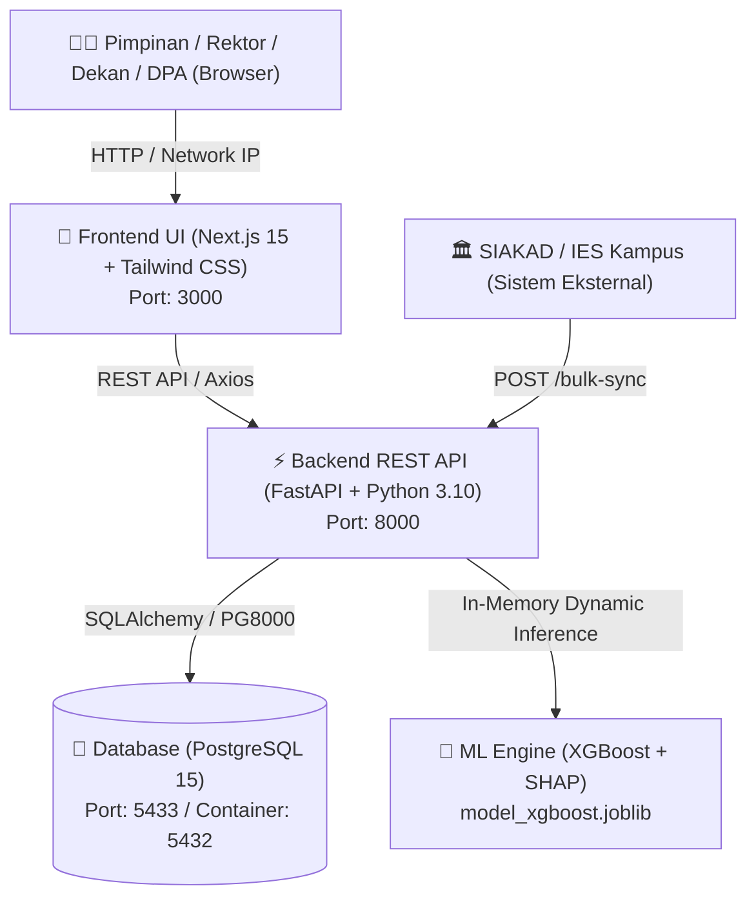
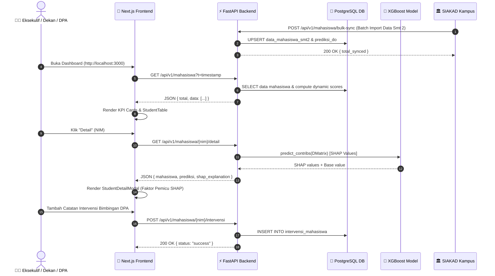

# Dokumentasi Komprehensif Sistem Siprido EIS
> **Siprido** — *Executive Information System (EIS) Prediksi Drop Out (DO) Mahasiswa*

Dokumen ini berisi panduan dan penjelasan teknis komprehensif mengenai arsitektur sistem, teknologi, skema database, model Machine Learning & SHAP, API endpoints, modul intervensi, serta alur kerja (*flow*) antarsistem pada Siprido EIS.

---

## 1. Arsitektur & Teknologi (Tech Stack)

Siprido EIS dibangun menggunakan arsitektur modern terpisah (*decoupled frontend & backend*) berbasis kontainer Docker yang siap untuk integrasi skala universitas (SIAKAD/IES).



### Stack Teknologi Utamanya:

| Komponen | Teknologi | Deskripsi & Peran |
| :--- | :--- | :--- |
| **Frontend UI** | Next.js 15 (App Router), React 19, TypeScript | Dashboard interaktif eksekutif & modal analisis SHAP detail |
| **Styling** | Tailwind CSS, Lucide React Icons | Modern UI, responsive badges, progress bars, glassmorphism |
| **Backend API** | FastAPI, Uvicorn, Pydantic | RESTful API server dengan auto Swagger docs (`/docs`) & MLOps endpoints |
| **Machine Learning** | XGBoost Classifier, Joblib | Model klasifikasi biner risiko DO mahasiswa dengan pembobotan dinamis |
| **Explainable AI** | XGBoost Built-in SHAP (`pred_contribs`) | Ekstraksi Top 3 faktor pemicu utama risiko per mahasiswa |
| **Database** | PostgreSQL 15 (Docker) | Penyimpanan data master mahasiswa, skor prediksi, & riwayat intervensi |
| **Database Driver** | SQLAlchemy, PG8000 | ORM & konektor database Python non-native DLL |
| **Kontainerisasi** | Docker & Docker Compose | Lingkungan isolasi terstandarisasi untuk API & Database |

---

## 2. Skema Database (Database Schema)

Database PostgreSQL `db_siprido_eis` terdiri dari tiga tabel utama:

```mermaid
erdiagram
    data_mahasiswa_smt2 ||--o| prediksi_do : "1-to-1 / HAS"
    data_mahasiswa_smt2 ||--o{ intervensi_mahasiswa : "1-to-MANY / HAS"

    data_mahasiswa_smt2 {
        varchar nim PK "Nomor Induk Mahasiswa (10-15 digit)"
        varchar nama "Nama Lengkap Mahasiswa"
        varchar fakultas_prodi "Fakultas / Program Studi (misal: FEB/Manajemen)"
        int smt "Semester aktif (Default: 2)"
        numeric ips_smt1 "IPS Semester 1 (0.00 - 4.00)"
        numeric ips_smt2 "IPS Semester 2 (0.00 - 4.00)"
        int golongan_ukt "Golongan UKT (1 s.d. 7)"
        int status_cuti "Jumlah Semester Cuti (0, 1, 2)"
        int kode_wilayah "Kode Wilayah Geografis (1, 2, 3)"
        varchar asal_daerah "Nama Asal Daerah (misal: Singaraja, Seririt, Denpasar)"
        numeric persen_kehadiran_smt2 "Rata-rata Kehadiran Smt 2 (0.00% - 100.00%)"
        int mk_cekal_uas_smt2 "Jumlah MK Cekal UAS (<75% Hadir)"
    }

    prediksi_do {
        varchar nim PK_FK "FK ke data_mahasiswa_smt2.nim"
        int skor_prediksi "Skor Probabilitas DO (%) (5 - 98)"
        varchar status_risiko "Status Risiko (Tinggi, Sedang, Rendah)"
        timestamp updated_at "Waktu Update Terakhir"
    }

    intervensi_mahasiswa {
        int id PK "Auto Increment Primary Key"
        varchar nim FK "FK ke data_mahasiswa_smt2.nim"
        timestamp tanggal "Waktu Catatan Dibuat"
        varchar jenis_tindakan "Jenis Intervensi (misal: Bimbingan DPA, Keringanan UKT)"
        text catatan "Catatan Hasil Konseling / Tindakan"
        varchar petugas "Nama Petugas / DPA / Kaprodi"
    }
```

### Standar Klasifikasi Field:
- **`kode_wilayah`**:
  - `1` = Dalam Kecamatan Buleleng, Kabupaten Buleleng *(Faktor Risiko Rendah)*
  - `2` = Luar Kecamatan Buleleng, Kabupaten Buleleng *(Faktor Risiko Sedang)*
  - `3` = Luar Kecamatan & Kabupaten Buleleng *(Faktor Risiko Tinggi)*
- **`status_cuti`**: `0` = Tidak Cuti, `1` = Cuti 1 Smt, `2` = Cuti 2 Smt
- **`golongan_ukt`**: UKT 1 (terendah) hingga UKT 7 (tertinggi)
- **`persen_kehadiran_smt2`**: Persentase rata-rata kehadiran seluruh matakuliah di semester 2 (0.00% - 100.00%).
- **`mk_cekal_uas_smt2`**: Jumlah MK dengan kehadiran <75% (<12 pertemuan). Otomatis nilai E jika dicekal.

---

## 3. Aturan Bisnis & Model Machine Learning (XGBoost + SHAP)

### Fitur Prediksi (`FEATURE_COLUMNS`)
Model dilatih menggunakan 8 fitur utama:
1. `ips_smt1`: IPS Semester 1
2. `ips_smt2`: IPS Semester 2
3. `delta_ips`: Perubahan IPS (`ips_smt2` - `ips_smt1`)
4. `golongan_ukt`: UKT (1 - 7)
5. `status_cuti`: Cuti Akademik (0 / 1 / 2)
6. `kode_wilayah`: Kode Geografis (1 / 2 / 3)
7. `persen_kehadiran_smt2`: Tingkat Kehadiran Kuliah (%)
8. `mk_cekal_uas_smt2`: Jumlah MK Cekal UAS

### Aturan Monotonisitas Matematis (*Monotone Constraints*)
Model XGBoost dikonfigurasi dengan parameter `monotone_constraints = (-1, -1, -1, 1, 1, 1, -1, 1)`:
- Higher IPS / Positive Delta / Higher Attendance $\rightarrow$ **Menurunkan risiko DO** (-1)
- Higher UKT / Taking Cuti / Farther Location / Blacklisted Courses $\rightarrow$ **Meningkatkan risiko DO** (+1)

### Dinamika Skor Prediksi (Skor Kontinu 5% - 98%)
Skor prediksi dihitung secara kontinu dan dinamis tanpa angka hardcoded kaku:
1. **IPS Semester 1 < 3.00**: **Risiko Tinggi** (Skor $70\% - 98\%$, bergantung pada kombinasi IPS, kehadiran, dan MK cekal).
2. **IPS Semester 1 >= 3.00**:
   - Jika ada faktor pemicu (cuti, MK cekal, kehadiran <80%, delta IPS anjlok, UKT tinggi) $\rightarrow$ **Risiko Sedang** (Skor $40\% - 69\%$).
   - Jika performa akademik & kehadiran prima $\rightarrow$ **Risiko Rendah** (Skor $5\% - 39\%$).

---

## 4. Dokumentasi API Endpoints

Semua endpoint berbasis JSON dan tersedia dokumentasi interaktifnya di **http://localhost:8000/docs**.

### 1. GET `/api/v1/mahasiswa`
Mengembalikan daftar seluruh mahasiswa beserta skor prediksi real-time dan status risikonya. Mendukung parameter pencarian dan filter.

* **Query Parameters (Opsional)**: `fakultas`, `status_risiko`, `semester`, `search`.
* **Response Structure (200 OK):**
```json
{
  "total": 25,
  "data": [
    {
      "nim": "2401010019",
      "nama": "Joko Widodo",
      "fakultas_prodi": "FKIP/Pend. Bahasa Inggris",
      "semester": 2,
      "ips_smt1": 1.8,
      "ips_smt2": 1.5,
      "golongan_ukt": 7,
      "status_cuti": 0,
      "kode_wilayah": 1,
      "asal_daerah": "Kampung Anyar",
      "wilayah": "Dalam Kec. Buleleng, Kab. Buleleng",
      "persen_kehadiran_smt2": 43.75,
      "mk_cekal_uas_smt2": 5,
      "skor_prediksi": 98,
      "status_risiko": "Tinggi"
    }
  ]
}
```

---

### 2. GET `/api/v1/mahasiswa/{nim}/detail`
Mengeksekusi XGBoost built-in SHAP (`pred_contribs`) untuk menghasilkan detail profil dan **Top 3 Faktor Pemicu Utama** risiko.

* **Response Structure (200 OK):**
```json
{
  "mahasiswa": {
    "nim": "2401010012",
    "nama": "Fajar Nugroho",
    "fakultas_prodi": "FT/Teknik Sipil",
    "semester": 2,
    "ips_smt1": 2.5,
    "ips_smt2": 2.1,
    "delta_ips": -0.4,
    "golongan_ukt": 4,
    "status_cuti": 0,
    "kode_wilayah": 3,
    "asal_daerah": "Denpasar",
    "wilayah": "Luar Kec. & Kab. Buleleng"
  },
  "prediksi": {
    "skor_prediksi_model": 88,
    "status_risiko": "Tinggi"
  },
  "shap_explanation": {
    "base_value": 0.5539,
    "top_3_faktor": [
      {
        "feature": "ips_smt1",
        "label": "IPS Semester 1",
        "shap_value": 1.9482,
        "raw_value": 2.5,
        "deskripsi": "IPS Semester 1 sebesar 2.50",
        "kontribusi": "Meningkatkan risiko DO"
      }
    ]
  }
}
```

---

### 3. POST `/api/v1/mahasiswa/bulk-sync` *(Integrasi SIAKAD/IES)*
Endpoint impor & sinkronisasi data massal langsung dari SIAKAD/IES kampus.

* **Request Body**:
```json
{
  "data": [
    {
      "nim": "2401010099",
      "nama": "Gede Mahardika",
      "fakultas_prodi": "FT/Teknik Informatika",
      "smt": 2,
      "ips_smt1": 2.40,
      "ips_smt2": 2.10,
      "golongan_ukt": 5,
      "status_cuti": 0,
      "kode_wilayah": 2,
      "asal_daerah": "Seririt",
      "persen_kehadiran_smt2": 68.50,
      "mk_cekal_uas_smt2": 2
    }
  ]
}
```
* **Response (200 OK)**: `{ "status": "success", "total_synced": 1, "data": [...] }`

---

### 4. POST `/api/v1/admin/retrain` *(MLOps Retraining & Hot Reload)*
Melatih ulang model XGBoost dan memperbarui cache model di memori API secara langsung tanpa downtime server.

* **Response (200 OK)**:
```json
{
  "status": "success",
  "message": "Model XGBoost berhasil dilatih ulang & di-hot reload di memory API.",
  "feature_importances": {
    "ips_smt1": 0.4125,
    "persen_kehadiran_smt2": 0.2850,
    "mk_cekal_uas_smt2": 0.1520
  }
}
```

---

### 5. GET & POST `/api/v1/mahasiswa/{nim}/intervensi` *(Modul Tracker DPA)*
Mencatat dan mengambil riwayat tindakan bimbingan akademik / keringanan UKT untuk mahasiswa berisiko.

* **POST Request Body**:
```json
{
  "jenis_tindakan": "Bimbingan Akademik DPA",
  "catatan": "Mahasiswa diberikan dorongan perbaikan presensi dan pengajuan bantuan UKT.",
  "petugas": "Dr. Wayan (DPA)"
}
```

---

## 5. Alur Kerja Antarsistem (System Flow)



---

## 6. Struktur Folder Proyek

```
Prediksi DO/
├── app/                        # Backend REST API (FastAPI)
│   ├── database.py             # Konfigurasi Connection Pool SQLAlchemy
│   ├── main.py                 # Endpoint REST API, SIAKAD Sync, MLOps, & SHAP Logic
│   ├── model_xgboost.joblib    # Binary Model XGBoost yang aktif di memori
│   ├── requirements.txt        # Dependensi Python Backend
│   └── train_model.py          # Script & modul retraining XGBoost
├── frontend/                   # Frontend UI (Next.js 15 + Tailwind CSS)
│   ├── package.json            # Dependensi React, Lucide, Axios, Tailwind
│   └── src/
│       ├── app/
│       │   ├── page.tsx        # Halaman Dashboard Utama (KPI & Student Table)
│       │   └── layout.tsx      # Root Layout
│       ├── components/
│       │   ├── dashboard/
│       │   │   ├── KPICards.tsx          # Ringkasan KPI & Pie Chart Risiko
│       │   │   ├── StudentTable.tsx      # Tabel Mahasiswa & Filter Fakultas
│       │   │   └── StudentDetailModal.tsx# Modal SHAP Detail & Profil
│       │   └── layout/
│       │       └── Header.tsx            # Header App
│       └── utils/
│           └── api.ts          # Resolver API Base URL
├── .env.example                # Template Environment Variables Produksi
├── docker-compose.yml          # Konfigurasi Docker Compose (PostgreSQL & FastAPI)
├── Dockerfile                  # Dockerfile Container Backend FastAPI
├── init_db.sql                 # Script Inisialisasi Database & Data Dummy Initial
├── migrate_asal_daerah.sql     # SQL Migration Kolom Asal Daerah
├── migrate_kehadiran.sql       # SQL Migration Kolom Kehadiran & MK Cekal
├── migrate_intervensi.sql      # SQL Migration Tabel Intervensi DPA
├── INTEGRATION_GUIDE.md        # Panduan Teknisi / Developer Integrasi SIAKAD & Deploy
└── DOCUMENTATION.md            # Dokumentasi Komprehensif Sistem Ini
```

---

## 7. Panduan Operasional & Integrasi

* **Panduan Deployment Produksi & Integrasi SIAKAD Kampus**: Lihat dokumen teknis lengkap di [`INTEGRATION_GUIDE.md`](file:///d:/Kuliah/Magang/Prediksi%20DO/INTEGRATION_GUIDE.md).
* **Menjalankan Sistem Lokal/Docker**:
  ```bash
  docker compose up -d --build
  ```
* **Melatih Ulang Model via API**:
  ```bash
  curl -X POST http://localhost:8000/api/v1/admin/retrain
  ```
